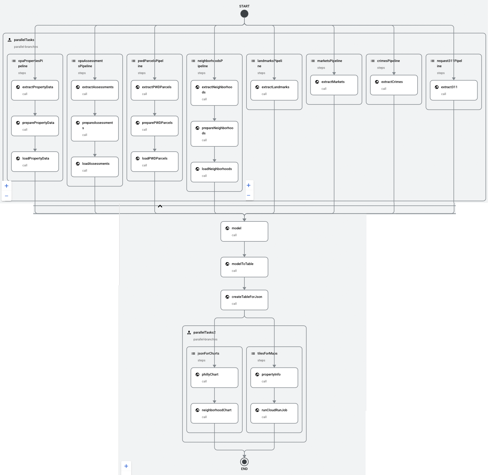

# Philadelphia Computer-Assisted Mass Appraisal (CAMA) Project

The following is a description of the various infrastructural components of the project. **The names and schemas used here are important, as each team will be working on different components of the project. The names and schemas are designed to be consistent across teams, so that the various components can be integrated together.** If you have any questions about the names or schemas, please ask!

The overview slides for the project are available [here](https://docs.google.com/presentation/d/1XRS2O_0IJNv2jknYMHfWHBhhqFn0e2gyK_vgbQMAUKg/edit?usp=sharing).

## Cloud Storage Buckets

Since bucket names must be globally unique, each name contains `team<N>` which should be replaced with your actual team number (i.e., `team1`, `team2`, etc.). The buckets are organized as follows:

| Bucket name | Description of contents |
|-------------|-------------------------|
| `musa5090s25-team<N>-raw_data` | Raw data from the sources. |
| `musa5090s25-team<N>-prepared_data` | Data prepared for external tables in BigQuery. |
| `musa5090s25-team<N>-temp_data` | Temporary data used during processing. Files stored here will be deleted after a few days. |
| `musa5090s25-team<N>-public` | Files that are accessible to the public. These files are primarily inteded to be consumed by the assessment review and property information apps. |

### Raw Data

In the `musa5090s25-team<N>-raw_data` bucket, there are three folders. Each folder may contain one or multiple files, depending on the type of data loaded (for example, a shapefile may be stored as multiple files). The folders are as follows:

| Folder | Contents |
|--------|----------|
| `/opa_properties/` | Contains the "properties" data downloaded from the [Philadelphia Properties and Assessment History](https://opendataphilly.org/dataset/opa-property-assessments) dataset on OpenDataPhilly. |
| `/opa_assessments/` | Contains the "property assessment history" data downloaded from the [Philadelphia Properties and Assessment History](https://opendataphilly.org/dataset/opa-property-assessments) dataset on OpenDataPhilly. |
| `/pwd_parcels/` | Contains the "PWD parcels" data downloaded from the [PWD Stormwater Billing Parcels](https://opendataphilly.org/dataset/pwd-stormwater-billing-parcels) dataset on OpenDataPhilly. |

There are other datasets available on OpenDataPhilly that may be useful for the project (e.g. [Real Estate Transfers](https://opendataphilly.org/datasets/real-estate-transfers/) contains a history of property sales back to 1999, or [Building and Zoning Permits](https://opendataphilly.org/datasets/licenses-and-inspections-building-and-zoning-permits/) can tell you when properties have had renovations, or [Street Centerlines](https://opendataphilly.org/datasets/street-centerlines/) could help identify major arterials, ...), but I encourage you to start simple with the datasets in the table above.

### Prepared Data

In the `musa5090s25-team<N>-prepared_data` bucket, there are three folders. Each should contain a single file named `data.jsonl` or `data.parquet`. The folders are as follows:

| Folder | Contents |
|--------|----------|
| `/opa_properties/` | Contains the "properties" data prepared for external tables in BigQuery. |
| `/opa_assessments/` | Contains the "property assessment history" data prepared for external tables in BigQuery. |
| `/pwd_parcels/` | Contains the "PWD parcels" data prepared for external tables in BigQuery. |

### Public Files

The `musa5090s25-team<N>-public` bucket contains files that are formatted to be used in the assessment review dashboard. These files are accessible via public URLs. Files used in this way (as artifacts for a web application) are often called "assets".

| Folder | Contents |
|--------|----------|
| `/tiles/` | Map tiles for the assessment reviewer
| `/configs/` | Configuration files for the charts and other parts of the assessment reviewer interface.

## BigQuery

### Datasets

| Dataset | Description |
|---------|-------------|
| `source` | External tables backed by prepared source data in Cloud Storage. |
| `core` | Data that is ready to be used for analysis. For the most part, the tables here are just copies of the external tables. |
| `derived` | Data that has been derived from core data. Outputs from analyses or models go here. |

### Tables

#### Source Tables

The tables in `source` are external tables. These are your warehouse's raw materials. The data is stored in JSON-L or Parquet files in the `musa5090s25-team<N>-prepared_data` Cloud Storage bucket.

- `source.opa_properties`
- `source.opa_assessments`
- `source.pwd_parcels`

#### Core Tables

There's a correlated table in `core` for each table in `source`. Even though external tables are convenient for getting data into BigQuery, they're not the most efficient to query from. So, we copy the data into a table in `core` and query from there. There may be some cleaning and normalization useful that you do to the source data as you copy it over, such as ensuring that numbers and dates are stored in the correct format.

In addition to the fields from the raw tables, each of the core tables will have a cleaned and standardized `property_id` string field (derived from the OPA or BRT number) that can be used as the unique identifier for a property across the tables.

- `core.opa_properties`
- `core.opa_assessments`
- `core.pwd_parcels`

#### Derived Tables

The `derived` schema contains all-new tables with data based on analyses and predictions on data from the `core` tables. Below, each table is listed with the _minimal_ fields to include. The tables may have more fields than these (e.g., for `current_assessments` we may choose to store confidence interval data), but they will definitely have _at least_ the listed fields.

- `derived.tax_year_assessment_bins` -- The bins used to create the assessment distribution chart for a given tax year.
  
  *Minimal fields:*
  - `tax_year`
  - `lower_bound`
  - `upper_bound`
  - `property_count`

- `derived.current_assessment_bins` -- The bins used to create the distribution chart for the values generated by the assessment model.
  
  *Minimal fields:*
  - `lower_bound`
  - `upper_bound`
  - `property_count`

- `derived.property_tile_info` -- The information needed to generate map tiles for the assessment review dashboard.

  *Minimal fields:*
  - `property_id`
  - `address`
  - `geog`
  - `current_assessed_value` (as predicted by the model in the `derived.current_assessments` table)
  - `tax_year_assessed_value` (during the most recent tax year in the `core.opa_assessments` table)

- `derived.assessment_inputs` -- The inputs used to predict the current assessment value for each property.

  *Minimal fields:*
  - `property_id`
  - Whatever other fields are needed to make predictions...

- `derived.tax_year_assessments` -- The assessment values for each property for each tax year.

  *Minimal fields:*
  - `tax_year`
  - `property_id`
  - `assessed_value`

- `derived.current_assessments` -- The current assessment values for each property as predicted by the model.

  *Minimal fields:*
  - `property_id`
  - `assessed_value`

## Cloud Functions

### Extracting

Each of these tasks download data from some source and store the data in `musa5090s25-team<N>-raw_data`.

- `extract-opa-properties`
- `extract-opa-assessments`
- `extract-pwd-parcels`

### Preparing (i.e. little-t transforming)

Each of these tasks read raw stored data from GCS and converts it into a clean CSV file in `musa5090s25-team<N>-prepared_data`.

- `prepare-opa-properties`
- `prepare-opa-assessments`
- `prepare-pwd-parcels`

### Loading

Each of these creates (or replaces) an external table in the `source` dataset in BigQuery, and creates or replaces a copy of that data in the `core` dataset.

- `load-opa-properties`
- `load-opa-assessments`
- `load-pwd-parcels`

### Transforming (big-T)

Each of these tasks reads data from the `core` dataset, performs some analysis or aggregation, and writes the results to the `derived` dataset.

- `transform-tax-year-assessment-bins`
- `transform-current-assessment-bins`

### Generating assets

- `generate-property-map-tile-data`
- `generate-assessment-chart-configs`

## Cloud Run jobs

To run the assessment prediction across all the properties, we use a Cloud Run job named `predict-current-assessments`. The script reads the `derived.assessment_inputs` table and writes the results to the `derived.current_assessments` table.

To create the vector tiles for the assessment review dashboard, we use a Cloud Run job named `generate-property-map-tiles`. The script downloads the `property_tile_info.geojson` file from the `musa5090s25-team<N>-temp_data` bucket, generates vector tiles, and writes the results to the `musa5090s25-team<N>-public/tiles` folder.

## Workflows

For extracting, loading, transforming, and predicting on data, there is a single workflow named `data-pipeline`. This workflow is triggered by a Cloud Scheduler job that runs once per week.

## Service Accounts

In each project, a service account named `data-pipeline-user` was created to provide necessary access to different GCP services. The following roles are assigned to the service account:

- `Storage Object Admin`
- `BigQuery Job User`
- `Cloud Functions Invoker`
- `Cloud Run Invoker`
- `Workflows Invoker`

## Architecture

### Extract, prepare and load functions

4 functions extract data from the source URL, prepare them as `jsonl` files and load them as native BigQuery tables. The data are used in the model to predict 2025 property values, and in the front end to visualise historical and 2025 property values. The neighborhood geojson is also uploaded to the public bucket for front-end access.

- OPA properties
- OPA assessments
- PWD parcels
- Philadelphia neighborhoods

### Extract functions

4 extract functions provide additional data for the model. The prepare and load functions are skipped, and the data (in `csv` or `geojson` format) feed directly into the model function from the raw bucket.

- Landmarks
- Farmer markets
- Crimes
- 311 requests (trash)

### Model function

The model function runs a random forest model to predict 2025 property values using internal housing characteristics and spatial data. The model function outputs predicted values as a `csv` and uploads it to the temporary bucket. 

### Model to table function

This function converts the `csv` with predicted values into an external table, then a native table in BigQuery.

### Create table functions

This function runs 5 SQL files to create 5 native tables in BigQuery: 1 with all historical property values, and 4 for the assessment bins used in the front end, with the predicted and historical data at the philadelphia scale and neighbourhood scale. 

### Vector tile functions

A first function creates the `property_tiles_info.geojson` using the BigQuery tables, while a second function uses the geojson to update vector tiles. The vector tiles are used to create the map on the front end.

### Create JSON functions

A first function creates 2 `json` files for the philadelphia scale data, while a second function creates 2 `json` files for the neighbourhood scale data. The `json` files are used to create charts on the front end. 

### API

2 APIs allow the front end to directly query the BigQuery table with historical property values. The first API queries 6 properties based on the address typed in for the suggestion lists in the widget, while the second API queries the property data based on the exact address typed in for the popup window in the reviewer's page front, which includes predicted values for 2025 and the changes between 2024 and 2025. 

## Deployment
Cloud functions and API are written as Python scripts. All codes used for deploying cloud functions, API, the workflow `yml` file, and the public bucket CORS configuration are documented in `DEPLOY.md`. 